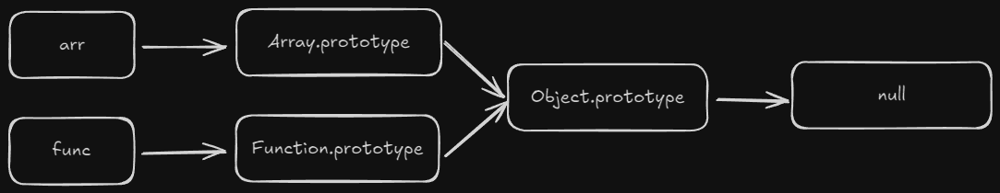
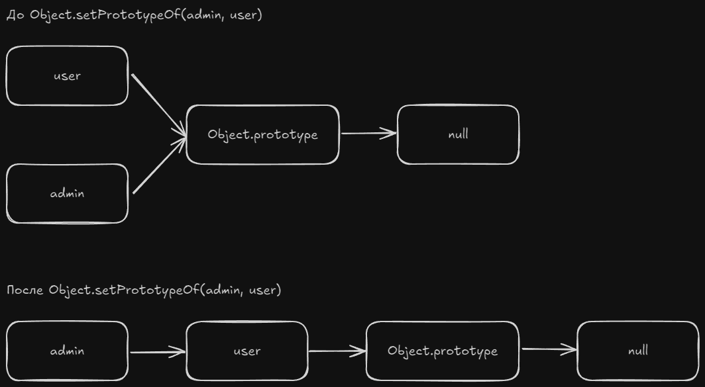
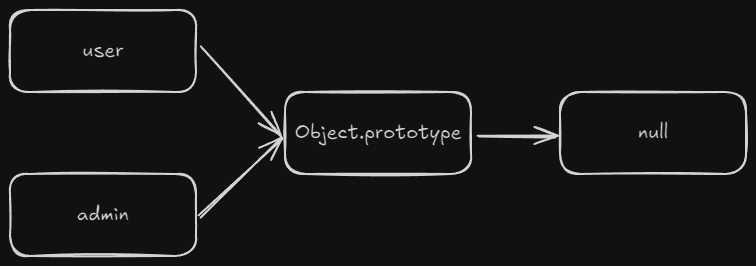
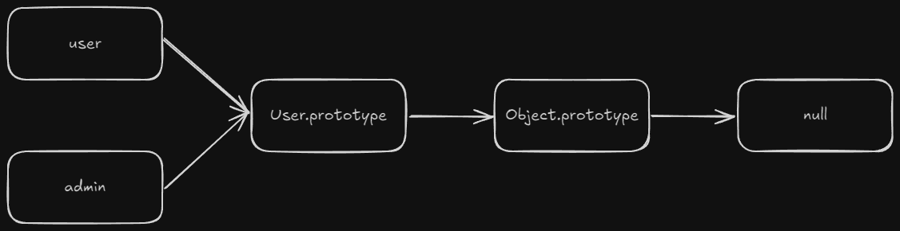

# Прототипы в JS

> В этой главе рассматриваются прототипы - основа JavaScript. И хоть напрямую вам крайне редко придется с ними работать, понимать их будет очень полезно. В дальнейшем это облегчит понимание работы классов.

Весь JS работает на **прототипах**. Рассмотрим пример:

```ts
const user = {
  name: 'Kirill',
};

console.log(user.name); // "Kirill"
console.log(user.toString()); // "[object Object]"
```

Здесь мы создаем объект `user`. В объекте мы явно указали поле `name` и можем с ним работать. Но откуда взялся метод `toString()`? У нашего объекта этого поля нет, но оно есть у объекта `Object.prototype` (что такое `Object` разберем позже).

На самом деле, когда мы создаем какой-то объект, в JS созданному объекту добавляется ссылка на прототип.
## Прототипы

**Прототип** - это объект со своим набором полей и методов. Когда мы пытаемся обратиться к полю или методу, которого нет у нашего объекта, JS начинает искать его в прототипе нашего объекта.

Получить прототип объекта можно с помощью метода `Object.getPrototypeOf`:

```ts
const user = {
  name: 'Kirill';
};

const prototype = Object.getPrototypeOf(user);
console.log(prototype === Object.prototype); // true
```

Если вывести в консоль `Object.prototype`, можно увидеть его поля и методы.

Прототипы - это всегда про цепочки. Например, можно получить и прототип объекта `Object.prototype` - это будет `null`, т.е. конец цепочки:


Если мы попытаемся обратиться к какому-нибудь методу, алгоритм будет выглядеть примерно так:
```
Ищем метод у объекта user.
Метод есть? Вызываем его. Метода нет? Ищем дальше.
Ищем метод у Object.prototype.
Метод есть? Вызываем его. Метода нет? Ищем дальше.
У null методов быть не может. Выбрасываем ошибку.
```

С обращением к полям объекта история такая же. С той лишь разницей, что поле просто вернет `undefined`, если его нет.

Этот механизм называется **прототипным наследованием**. Когда мы говорим про наследование, мы всегда выделяем **родительский** и **дочерний** объект. Родительский объект (прототип) предоставляет поля и методы, а дочерний ими пользуется.

Более интересный пример с массивами и функциями:

```ts
const arr = [];
console.log(Object.getPrototypeOf(arr)); // Array.prototype
console.log(Object.getPrototypeOf(Array.prototype)); // Object.prototype

function func() {};
console.log(Object.getPrototypeOf(func)); // Function.prototype
console.log(Object.getPrototypeOf(Function.prototype)); // Object.prototype

console.log(Object.getPrototypeOf(Array.prototype) === Object.getPrototypeOf(Function.prototype)); // true
```



Мы можем написать собственный метод `toString()`. Тогда при его вызове мы не будем спускаться по цепочке прототипов. Обновим пример из начала урока:

```ts
const user = {
  name: 'Kirill',
  toString() {
    return `User: ${this.name}`;
  }
};

console.log(user.name); // "Kirill"
console.log(user.toString()); // "User: Kirill"
```

Теперь мы обращаемся к `toString()` объекта `user`, а не `Object.prototype`. Еще мы можем изменить свойства и самого прототипа:

```ts
Object.prototype.toString = () => {
  return 'I am object!';
}

const obj = {};
console.log(obj.toString()); // "I am object!";
```

> Изменять поля встроенных объектов НЕ РЕКОМЕНДУЕТСЯ в 99% случаев. Это может привести к непредсказуемому поведению. Это особенно опасно при использовании сторонних библиотек.

Мы можем менять прототипы у объектов. Для этого используется `Object.setPrototypeOf()`:

```ts
const user = {
  name: 'Kirill',
  sayHello() {
	  console.log(`Hi, ${this.name}!`);
  }
}

const admin = {
  name: 'Dmitriy',
}

Object.setPrototypeOf(admin, user); // !

user.sayHello(); // Hi, Kirill!
admin.sayHello(); // Hi, Dmitriy!
```

Цепочка прототипов принимает такой вид:



## Функции-конструкторы

Для создания объектов с повторяющимся функционалом, мы можем использовать простую функцию:

```ts
function createUser(name) {
  return {
	name,
	sayHello() {
	  console.log(`Hi, ${this.name}!`);
	}
  }
}

const user = createUser('Kirill');
const admin = createUser('Dmitriy');

user.sayHello(); // Hi, Kirill!
admin.sayHello(); // Hi, Dmitriy!
```



И это будет работать. Но в JS есть более элегантный способ создания таких объектов - через **функции-конструкторы**:

```ts
function User(name) { // 1
  this.name = name;
}

User.prototype.sayHello = function() { // 2
  console.log(`Hi, ${this.name}!`);
}

const user = new User('Kirill');  // 3
const admin = new User('Dmitriy');

user.sayHello(); // Hi, Kirill!
admin.sayHello(); // Hi, Dmitriy!

```



Разберем код:
1. Определяем функцию-конструктор. Эта функция инициализирует поле `name` согласно входным параметрам.
2. Устанавливаем функцию для прототипа User'a. Она будет доступна для всех дочерних объектов.
3. Создаем дочерние объекты `user` и `admin` через специальный оператор `new`.

**Функция-конструктор** - это специальная функция, чья задача создать объект. Под капотом, она создает пустой объект (на который ссылается `this`) и наполняет его полями. У этой функции доступен объект `prototype`. Для всех дочерних объектов `User.prototype` становится родителем.

Теперь вспомним `Object` и `Array`. На самом деле это точно такие же функции-конструкторы:

```ts
console.log(Object) // function Object()
console.log(Array) // function Array()

const obj1 = new Object();
const arr1 = new Array();

const obj2 = {};
const arr2 = [];

Object.getPrototypeOf(obj1) === Object.getPrototypeOf(obj2) // true
Object.getPrototypeOf(arr1) === Object.getPrototypeOf(arr2) // true
```

То как мы создаем `obj2` и `arr2` на деле является синтаксическим сахаром.

Стоит также отметить - у поля `.prototype` есть поле `.constructor`. Это как раз ссылка на функцию-конструктор, с которой связан прототип:

```ts
console.log(Object.prototype.constructor) // function Object()
Object === Object.prototype.constructor // true
```

## Статичные методы

Еще один вопрос остался не отвеченным: почему мы пишем `Date.now()`, а не `Date.prototype.now()`? Откуда взялось это поле?

Поля и методы, доступные у функции, называются **статичными (static)**. Они не привязываются к объекту при его создании, а значит и не могут обратиться к нему через `this`. Они используются, когда мы хотим выполнить операцию, но нам не нужен новый объект. Пара примеров:

```ts
Date.now() // Чтобы получить текущее время, нам не нужен объект даты
Object.getPrototypeOf() // Чтобы получить прототип объекта, нам не нужно для этого создавать новый
Object.getPrototypeOf.name // вернет "getPrototypeOf", т.е. название самой себя. ".name" это статичное поле статичного метода `getPrototypeOf`
```

Польза от статичных методов будет рассмотрена в следующих главах.